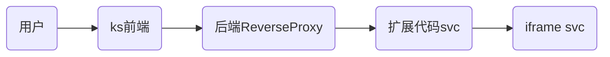

## 环境准备

1. 准备 Kubernetes 集群

   KubeSphere Luban 在任何 Kubernetes 集群上均可安装。可以使用 [KubeKey](https://github.com/kubesphere/kubekey) 快速部署 K8s 集群。

   ```bash
   curl -sfL https://get-kk.kubesphere.io | sh -
   ./kk create cluster --with-local-storage  --with-kubernetes v1.25.4 --container-manager containerd  -y
   ```

2. 安装 KubeSphere Luban。

   ```bash
   helm upgrade --install -n kubesphere-system --create-namespace ks-core  https://charts.kubesphere.io/test/ks-core-0.6.3.tgz --set apiserver.nodePort=30881 --debug --wait
   ```


3. 配置连接

   复制 K8s 集群的 [kubeconfig](https://kubernetes.io/zh-cn/docs/concepts/configuration/organize-cluster-access-kubeconfig/) 配置文件到开发主机的`~/.kube/config`，确保使用 kubectl 可以正常访问 K8s 集群。

   ```bash
   ➜  kubectl -n kubesphere-system get po
   NAME                                     READY   STATUS    RESTARTS       AGE
   ks-apiserver-7c67b4577b-tqqmd            1/1     Running   0              10d
   ks-console-7ffb5954d8-qr8tx              1/1     Running   0              10d
   ks-controller-manager-758dc948f5-8n4ll   1/1     Running   0              10d
   ```

## 基础示例

初始化扩展组件

1. 执行以下命令初始化扩展组件开发项目：

   ```bash
   mkdir -p ~/kubesphere-extensions
   cd ~/kubesphere-extensions
   yarn add global create-ks-project
   yarn create ks-project ks-console
   ```

2. 执行以下命令创建 Hello World 扩展组件：

   ```bash
   cd ks-console
   yarn create:ext
   ```

   根据命令提示，设置扩展组件的名称、显示名称、描述、作者和语言等基础信息，完成扩展组件创建。

   ```bash
   Extension Name hello-world
   Display Name Hello World
   Description Hello World!
   Author demo
   Language JavaScript
   Create extension [hello-world]? Yes
   ```

3. 配置本地运行环境

   在 `kubesphere-extensions/ks-console/configs/local_config.yaml` 文件中进行如下配置。

   ```yaml
    server:
      apiServer:
        url: http://192.168.50.218:30881 # ks-apiserver 的 IP 与端口地址
        wsUrl: ws://192.168.50.218:30881 # ks-apiserver 的 IP 与端口地址
   ```

1. 执行以下命令运行：

   ```bash
   cd ~/kubesphere-extensions/ks-console/
   yarn dev
   ```

2. 打开浏览器，访问 `http://localhost:8000`，使用默认用户名 `admin` 和密码 `P@88w0rd` 登录,顶部导航栏将出现 `Hello World` 扩展组件的访问入口。

   

挂载位置

可修改`kubesphere-extensions/ks-console/extensions/hello-world/src/index.js` 设置挂载位置，例如：

```javascript
const menu = { 
  parent: 'topbar', //topbar:顶部菜单栏; global:扩展组件菜单; toolbox:工具箱菜单; access:用户和角色管理页面左侧导航栏; cluster/workspace/project:集群/企业空间/项目管理左侧导航栏; platformSettings:平台设置页面左侧导航栏;
  name: 'hello-world',
  link: '/hellow-world',
  title: 'HELLO_WORLD',
  icon: 'cluster',
  order: 0,
  desc: 'HELLO_WORLD_DESC',
  authKey: 'hello',
  authAction: 'hello-view',
  skipAuth: true,
};
```

位置示例: 顶部菜单栏


位置示例: 扩展组件菜单

在顶部菜单栏点击  图标打开菜单。


## 场景与示例

插件一般有以下几种集成场景

| **集成方式**                            | **开发成本** | 采用度 | **用户体验**                                               |
| --------------------------------------- | ------------ | ------ | ---------------------------------------------------------- |
| 编排为 Helm Chart 通过应用商店上架      | 低           | 较少   | 适用于不需要 UI 界面的扩展组件，例如后台任务、数据处理等。 |
| 通过 iframe 嵌入已有的页面              | 中           | 最常见 | 适用于已有 UI 界面的扩展组件，  UI 风格可调整              |
| 基于 KubeDesign  打造自己的可视化控制台 | 高           | 较少   | 风格统一                                                   |

### iframe 嵌入

写一个简单web, 并用nginx运行起来

首页:` index.html`

> 注意, 这里资源都使用的相对路径, 下文会提到这一点

```html
<!doctype html>
<html lang="en">
<head>
    <meta charset="UTF-8">
    <link rel="stylesheet" href="./a.css">
    <script type="text/javascript" src="./a.js"></script>
</head>
<body>
    hello
</body>
</html>
```

样式:  `a.css`

```css
body {
    display: flex;
    justify-content: center;
    align-items: center;
}
```

js文件: `a.js`

```js
document.addEventListener('DOMContentLoaded', function () {
    console.log("hello iframe")
});
```

找一台主机运行这个web, 我这里使用`nginx`代理它, 监听于`10.8.0.2`

配置反向代理

```yaml
apiVersion: extensions.kubesphere.io/v1alpha1
kind: ReverseProxy
metadata:
  name: weave.works
spec:
  directives:
    headerUp:
    - -Authorization
    stripPathPrefix: /proxy/abc
  matcher:
    method: '*'
    path: /proxy/abc/*
  upstream:
    url: http://10.8.0.2 # 简单web的运行地址, 10.8.0.2是我的开发主机, 实际环境为业务的svc地址
status:
  state: Available
```

修改hello-world代码

`kubesphere-extensions/ks-console/extensions/hello-world/src/App.jsx`

```js
import React, {useState, useRef, useEffect} from 'react';
import {Loading} from '@kubed/components';

export default function App() {
    const [loading, setLoading] = useState(true);
    const FRAME_URL = '/proxy/abc/';
    const iframeRef = useRef();
    const onIframeLoad = () => {
        setLoading(false);
    };

    return (
        <>
            {loading && <Loading className="page-loading"/>}
            <iframe
                ref={iframeRef}
                src={FRAME_URL}
                width="100%"
                height="100%"
                frameBorder="0"
                style={{
                    height: 'calc(100vh - 68px)',
                    display: loading ? 'none' : 'block',
                }}
                onLoad={onIframeLoad}
            />
        </>
    );
}
```

此时, 访问即可看到已经嵌入了页面


### 问题1: js无法加载

虽然页面正常显示, 但是打开f12会发现js没有正常载入


解决方案
配置 `kubesphere-extensions/ks-console/configs/webpack.config.js`

```js
const { merge } = require('webpack-merge');
const baseConfig = require('@ks-console/bootstrap/webpack/webpack.dev.conf');

const webpackDevConfig = merge(baseConfig, {
  devServer: {
    proxy: {
      '/proxy': {
        target: 'http://192.168.50.218:30881', // 修改为目标 ks-apiserver 的地址
        onProxyReq: (proxyReq, req, res) => {
            const username = 'admin'        // 请求代理时的用户凭证
            const password = 'P@88w0rd'
            const auth = Buffer.from(`${username}:${password}`).toString("base64");
            proxyReq.setHeader('Authorization', `Basic ${auth}`);
          },
      },
    },
  },
});

module.exports = webpackDevConfig;
```

> 1.能不能直接整合进脚手架 
>
> 2.请求代理时的用户名和密码只能更编码么, 修改了怎么办(这个只在开发模式用到, 所以没关系?)

### 问题2: 资源绝对路径

资源文件使用的是绝对路径, 此时使用iframe载入会出现加载不了的情况, 例如我们修改`index.html`中的`"/a.css"`

```html
<!doctype html>
<html lang="en">
<head>
    <meta charset="UTF-8">
    <link rel="stylesheet" href="/a.css">
    <script type="text/javascript" src="./a.js"></script>
</head>
<body>
    hello
</body>
</html>
```

此时查看页面


虽然css文件显示200, 但实际并未获取到预期的css, 文字没有居中

#### 解决方案一

修改应用代码, 将资源改为相对路径, 如果项目是webpack打包的, 可以配置编译文件统一修改加载路径

@安东亦 补充示例操作

```
```

#### 解决方案二

通过域名加载iframe,   实际环境中, 可以通过`ingress` 配置实现域名, 我这里简单配置hosts实现

```js
export default function App() {
    const [loading, setLoading] = useState(true);
    // const FRAME_URL = '/proxy/abc/';
    const FRAME_URL = 'http://www.imac.com';
  ...
```

这种情况不再需要配置 `ReverseProxy` ,当然由于不再经过ks的代理, 也就无法使用权限限制了

### 问题3: 用户信息获取

默认的token信息由于是`HttpOnly`的,js无法取得, 我们可以在扩展代码中可以通过`globals.user`拿到用户信息, 再传给iframe组件即可

在`kubesphere-extensions/ks-console/extensions/hello-world/src/App.jsx`中添加如下代码

```js
useEffect(() => {
        window.addEventListener(
            'message',
            event => {
                try {
                    if (event.data) {
                        const data = JSON.parse(event.data);
                        if (data.event_id === 'getUserInfo') {
                            event.source.postMessage(
                                JSON.stringify({
                                    event_id: data.cb_event_id,
                                    data: globals.user,
                                }),
                            );
                        }
                    }
                } catch (error) {
                    //console.error(error);
                }
            },
            '*',
        );
    }, []);
```

在业务代码`a.js`中添加如下代码

```js
window.onload = () => {
    window.addEventListener('message', event => {
        try {
            if (event.data) {
                const data = JSON.parse(event.data);
                if (data.event_id === 'getUserInfo') {
                    console.log('iframe中取得', data.data);
                }
            }
        } catch (error) {
            console.error(error);
        }
    });

    window.parent.postMessage(
        JSON.stringify({
            event_id: 'getUserInfo',
            cb_event_id: 'getUserInfo',
        }),
        '*',
    );
}
```


即可在iframe的页面中, 取得用户信息

> 域名的方式拿不到? @安东亦

### 问题4: oauth对接

#### 代码示例

创建 `OAuth Client` 配置

```yaml
cat << EOF | kubectl apply -f -
apiVersion: v1
stringData:
  configuration.yaml: |
    name: test 
    secret: fake 
    grantMethod: auto
    scopeRestrictions:
      - 'openid'
      - 'email'
      - 'profile'
    redirectURIs:
      - http://10.8.0.2:5556/auth/google/callback 
kind: Secret
metadata:
  name: oauthclient
  namespace: kubesphere-system
  labels:
    config.kubesphere.io/type: oauthclient
    config.kubesphere.io/oauthclient-name: kubesphere
type: config.kubesphere.io/oauthclient
EOF
```

使用示例代码, [参考代码](https://github.com/coreos/go-oidc/blob/v3/example/idtoken/app.go)

```go
/*
This is an example application to demonstrate parsing an ID Token.
*/
package main

import (
    "crypto/rand"
    "encoding/base64"
    "encoding/json"
    "io"
    "log"
    "net/http"
    "time"

    "github.com/coreos/go-oidc/v3/oidc"
    "golang.org/x/net/context"
    "golang.org/x/oauth2"
)

var (
    clientID     = "test"
    clientSecret = "fake"
)

func randString(nByte int) (string, error) {
    b := make([]byte, nByte)
    if _, err := io.ReadFull(rand.Reader, b); err != nil {
        return "", err
    }
    return base64.RawURLEncoding.EncodeToString(b), nil
}

func setCallbackCookie(w http.ResponseWriter, r *http.Request, name, value string) {
    c := &http.Cookie{
        Name:     name,
        Value:    value,
        MaxAge:   int(time.Hour.Seconds()),
        Secure:   r.TLS != nil,
        HttpOnly: true,
    }
    http.SetCookie(w, c)
}

func main() {
    ctx := context.Background()

    provider, err := oidc.NewProvider(ctx, "http://ks-console.kubesphere-system.svc:30880")
    if err != nil {
        log.Fatal(err)
    }
    oidcConfig := &oidc.Config{
        ClientID: clientID,
    }
    verifier := provider.Verifier(oidcConfig)

    config := oauth2.Config{
        ClientID:     clientID,
        ClientSecret: clientSecret,
        Endpoint:     provider.Endpoint(),
        RedirectURL:  "http://10.8.0.2:5556/auth/google/callback",
        Scopes:       []string{oidc.ScopeOpenID, "profile", "email"},
    }

    http.HandleFunc("/", func(w http.ResponseWriter, r *http.Request) {
        state, err := randString(16)
        if err != nil {
            http.Error(w, "Internal error", http.StatusInternalServerError)
            return
        }
        nonce, err := randString(16)
        if err != nil {
            http.Error(w, "Internal error", http.StatusInternalServerError)
            return
        }
        setCallbackCookie(w, r, "state", state)
        setCallbackCookie(w, r, "nonce", nonce)

        http.Redirect(w, r, config.AuthCodeURL(state, oidc.Nonce(nonce)), http.StatusFound)
    })

    http.HandleFunc("/auth/google/callback", func(w http.ResponseWriter, r *http.Request) {
        state, err := r.Cookie("state")
        if err != nil {
            http.Error(w, "state not found", http.StatusBadRequest)
            return
        }
        if r.URL.Query().Get("state") != state.Value {
            http.Error(w, "state did not match", http.StatusBadRequest)
            return
        }

        oauth2Token, err := config.Exchange(ctx, r.URL.Query().Get("code"))
        if err != nil {
            http.Error(w, "Failed to exchange token: "+err.Error(), http.StatusInternalServerError)
            return
        }
        rawIDToken, ok := oauth2Token.Extra("id_token").(string)
        if !ok {
            http.Error(w, "No id_token field in oauth2 token.", http.StatusInternalServerError)
            return
        }
        idToken, err := verifier.Verify(ctx, rawIDToken)
        if err != nil {
            http.Error(w, "Failed to verify ID Token: "+err.Error(), http.StatusInternalServerError)
            return
        }

        nonce, err := r.Cookie("nonce")
        if err != nil {
            http.Error(w, "nonce not found", http.StatusBadRequest)
            return
        }
        if idToken.Nonce != nonce.Value {
            http.Error(w, "nonce did not match", http.StatusBadRequest)
            return
        }

        oauth2Token.AccessToken = "*REDACTED*"

        resp := struct {
            OAuth2Token   *oauth2.Token
            IDTokenClaims *json.RawMessage // ID Token payload is just JSON.
        }{oauth2Token, new(json.RawMessage)}

        if err := idToken.Claims(&resp.IDTokenClaims); err != nil {
            http.Error(w, err.Error(), http.StatusInternalServerError)
            return
        }
        data, err := json.MarshalIndent(resp, "", "    ")
        if err != nil {
            http.Error(w, err.Error(), http.StatusInternalServerError)
            return
        }
        w.Write(data)
    })

    log.Printf("listening on http://%s/", "10.8.0.2:5556")
    log.Fatal(http.ListenAndServe("10.8.0.2:5556", nil))
}
```
访问`10.8.0.2:5556` 会触发登录, 登录后再访问`10.8.0.2:5556`可以看到已经可以拿到oauth信息


**几点注意**:

1. Secret的配置中, `name`与`secret`要与代码中的`clientID`和`clientSecret`一致

2. 回调地址要一致

3. `oidc.NewProvider(ctx, "http://ks-console.kubesphere-system.svc:30880")` 中的这个url配置于`kubectl get cm -n kubesphere-system kubesphere-config` 的`authentication.issuer.host`中, 如果你的程序并不在k8s中, 需要把它改成实际的地址, 本地调试可通过配置hosts实现不修改

   ```bash
   root@m1:~# kubectl get cm -n kubesphere-system kubesphere-config -o yaml
   apiVersion: v1
   data:
     kubesphere.yaml: |
       authentication:
         authenticateRateLimiterMaxTries: 10
         authenticateRateLimiterDuration: 10m0s
         loginHistoryRetentionPeriod: 168h
         multipleLogin: true
         issuer:
           host: "http://ks-console.kubesphere-system.svc:30880"
           ...
   kind: ConfigMap
   metadata:
     name: kubesphere-config
     namespace: kubesphere-system
     
   cat /etc/hosts
   192.168.50.218 ks-console.kubesphere-system.svc
   ```

#### harbor示例

配置harbor使用oidc登录, 注意harbor要求使用`https` , 因此需要为ks的web配置https(操作略), 并修改上文中提到的`authentication.issuer.host` 为实际的值


通过OIDC 登录Harbor


## 打包发布

### 镜像制作

1. 编译

```bash
cd kubesphere-extensions/ks-console
yarn build:ext hello-world
# 生成文件
ls kubesphere-extensions/ks-console/extensions/hello-world/dist/index.js
```

2. 制作镜像

```bash
cd kubesphere-extensions/ks-console/extensions/hello-world/
docker build .
docker tag 500c030399f6 zichenkkkk/hello:latest
docker push zichenkkkk/hello:latest
```

### chart制作

下载 [latest ksbuilder release](https://github.com/kubesphere/ksbuilder/releases) 并移动到 `/usr/local/bin/`, 执行以下命令创建一个示例chart

```bash
➜ ksbuilder create
Please input extension name: hello-world
✔ other
Please input extension author: fake
Please input Email (optional): 
Please input author's URL (optional): 
Directory: /Users/inksnw/Desktop/hello-world

The extension charts has been created.
```

生成的chart项目`hello-world` 中, 由于我们只有前端 , 所以在`hello-world/value.yaml` 中, 关闭后端, 并修改前端镜像为我们刚推送的`zichenkkkk/hello:latest`

```yaml
frontend:
  enabled: true
  image:
    repository: zichenkkkk/hello
    tag: latest
backend:
  enabled: false
  image:
    repository: kubespheredev/hello-world-api
    tag: latest
```

打包

```bash
➜ ksbuilder package hello-world
package extension hello-world
package saved to /Users/inksnw/Desktop/hello-world-0.1.0.tgz
```

### 测试

推送安装包到集群

```bash
➜ ksbuilder publish hello-world-0.1.0.tgz
publish extension hello-world-0.1.0.tgz
creating Extension hello-world
creating ExtensionVersion hello-world-0.1.0
creating ConfigMap extension-hello-world-0.1.0-chart
```

此时在界面上即可看到我们的扩展已经提交


点击安装


访问,可以看到我们开发的扩展已经正常工作


调用链



以下配置也要整合进安装chart文件,测试阶段可以先不整合, 操作略

- 为你的iframe网页创建一个svc与pod, 即上图中的最后一步
- 后端ReverseProxy配置的yaml

### 发布

目前还未实现自动化发布, 请联系我们的商务人员手动提交chart包

## 权限相关

### 基础权限集成

可以通过上文中的`oauth`或`iframe 消息` 的方式拿到登录信息

建议将`admin`用户(超管)用户也映射到扩展的超管,普通用户则调用自身api创建一个普通用户(无权限), 再由超管用户手动分配权限, 用户点击扩展入口时, 通过映射好的用户直接进入界面, 跳过登录(代码帮忙登录)

### 深度权限集成(可选)

将应用的后端代码也使用ks的代理实现, 这样就可以通过ks的ui配置权限, 实现特定的路由与资源是否允许增删改查

> 注意! 需要后端的路由改造, 路由规则满足如下几种, 如您的代码无法修改请跳过本章节

- 平台作用域的 （`(apis/kapis)/GROUP/VERSION/*`）

- 集群作用域的（`/clusters/CLUSTER/(apis/kapis)/GROUP/VERSION/*`）

- 企业空间作用域的 （`(apis/kapis)/GROUP/VERSION/workspaces/WORKSPACE/*`）

- 名字空间作用域的（`/clusters/CLUSTER/(apis/kapis)/GROUP/VERSION/namespaces/NAMESPACE/*`）

#### KubeSphere 中的访问控制

KubeSphere 是一个支持多租户的容器管理平台，与 Kubernetes 相同，KubeSphere 通过基于角色的访问控制（RBAC）对用户的权限加以控制，实现逻辑层面的资源隔离。

KubeSphere 中的资源被划分为平台、企业空间、集群、项目四个层级，所有的资源都会归属到这四个资源层级之中，各层级可以通过角色来控制用户的资源访问权限。

**平台角色：** 主要控制用户对平台资源的访问权限，如集群的管理、企业空间的管理、平台用户的管理等。

**企业空间角色：** 主要控制企业空间成员在企业空间下的资源访问权限，如企业空间下项目、企业空间成员的管理等。

**项目角色：** 主要控制项目下资源的访问权限，如工作负载的管理、流水线的管理、项目成员的管理等。


#### RoleTemplate 示例

`RoleTemplate` 是由 KubeSphere 提供的 CRD， 用于声明权限项，是 KubeSphere UI 中最小的权限分割单元，通常用来定义某一类型资源的访问权限。各资源层级中的角色都由权限组合而成，基于权限项，用户可以灵活地创建自定义角色，实现精细的访问控制。

假设扩展组件中定义了 CRD `custom-resource`, 以下 YAML 文件创建了 `global-custom-resource-viewing` 和 `global-custom-resource-creation` 两个自定义权限，分别授权用户查看和创建 `custom-resource` 类型的资源，其中 `global-custom-resource-creation` 依赖于 `global-custom-resource-viewing`。

```yaml
apiVersion: iam.kubesphere.io/v1beta1
kind: RoleTemplate
metadata:
  name: global-custom-resource-view
  labels:
    iam.kubesphere.io/category: custom-resource-management
    iam.kubesphere.io/scope: global
    kubesphere.io/managed: 'true'
spec:
  displayName:
    en: Custom Resource Viewing
  rules:
    - apiGroups:
        - custom-api-group
      resources:
        - custom-resource
        - custom-resource-version
      verbs:
        - list
        - get
        - watch

---
apiVersion: iam.kubesphere.io/v1beta1
kind: RoleTemplate
metadata:
  name: global-custom-resource-manage
  annotations:
    iam.kubesphere.io/dependencies: global-custom-resource-view
  labels:
    iam.kubesphere.io/category: custom-resource-management
    iam.kubesphere.io/scope: global
    kubesphere.io/managed: 'true'
spec:
  displayName:
    en: Custom Resource Management
  rules:
    - apiGroups:
        - custom-api-group
      resources:
        - custom-resource
        - custom-resource-version
      verbs:
        - '*'
```

**RoleTemplate 参数说明**

以下介绍如何设置自定义权限的参数。

* `apiVersion`：KubeSphere 访问控制 API 的版本。当前版本为 `iam.kubesphere.io/v1beta1`。
* `kind`：自定义权限的资源类型。请将参数值设置为 `RoleTemplate`。
* `metadata`：自定义权限的元数据。
  * `name`：自定义权限的资源名称。
  * `annotations`：
    * `iam.kubesphere.io/dependencies`: 在 Console 中会显示为依赖关系，当选中这个权限项时会自动选中依赖的权限项。
    * `iam.kubesphere.io/role-template-rules`: 具体控制 Console 权限规则，相见下文 [Console 前端权限控制](./#console-前端权限控制)。
  * `labels`：
    * `iam.kubesphere.io/scope`：自定义权限的资源标签。KubeSphere 将权限分为平台、集群、企业空间和项目权限。取值 `global` 表示当前权限为平台级别的权限。可选的值有 `global`、`cluster`、`workspace` 和 `namespace`。
    * `iam.kubespere.io/category`：标记权限项所属的类别。
    * `iam.kubespere.io/managed`：KubeSphere 管理的授权项。
* `spec`
  * `displayName`：显示名称，支持国际化
    * `en`：英文显示名称。
    * `zh`：中文显示名称。
  * `rules`：自定义权限向用户授权的资源和操作。此参数为自定义权限内容的实际定义。
    * `apiGroups`：向用户授权的资源类型所属的 API 组。取值 `'*'` 表示当前权限级别的所有 API 组。
    * `resources`：向用户授权的资源类型，可以为 CRD（例如本节示例中的 `custom-resource`，`custom-resource-version`）或 Kubernetes 默认资源类型（例如 `deployment`）。取值 `'*'` 表示当前权限级别的所有资源类型。
    * `verbs`：向用户授权的操作。取值 `'*'` 当前权限级别的所有操作。有关资源操作类型的更多信息，请参阅 [Kubernetes 官方文档](https://kubernetes.io/docs/reference/access-authn-authz/authorization/)。

#### Category

Category 用于标记 RoleTemplate 所属的类别。KubeSphere Console 将根据权限项的类别将权限项分组显示。对应 RoleTemplate 的 label `iam.kubesphere.io/category: custom-resource-management`。

```yaml
apiVersion: iam.kubesphere.io/v1beta1
kind: Category
metadata:
  name: custom-resource-management
  labels:
    iam.kubesphere.io/scope: global
    kubesphere.io/managed: 'true'  
spec:
  displayName:        
    en: Custom Resource Management
```

Category 参数说明

* `apiVersion`：KubeSphere 访问控制 API 的版本。当前版本为 `iam.kubesphere.io/v1beta1`。
* `kind`：自定义权限的资源类型。请将参数值设置为 `Category`。
* `metadata`：自定义权限的元数据。
  * `name`：自定义权限的资源名称。
  * `labels`：
    * `iam.kubesphere.io/scope`：自定义权限的资源标签。KubeSphere 将权限分为平台、集群、企业空间和项目权限。取值 `global` 表示当前权限为平台级别的权限。可选的值有 `global`、`cluster`、`workspace` 和 `namespace`。
    * `spec`
      * `displayName`：显示名称，支持国际化
        * `en`：英文显示名称。
        * `zh`：中文显示名称。

#### 自定义角色创建

声明 RoleTemplate、Category 后，创建自定义角色：


配置好角色后, 给一个用户添加这个角色, 如果这个角色只分配了view权限, 那么当他调用后端相应路由的post方法就会被阻止 

> 再次强调这要求后端被代理, 并满足我们约定的路由规则

#### Console 前端权限控制

menu 权限设置

```JavaScript
// menu 涉及权限字段
const menu = { 
  name: 'hello-world',     // name 必填字段
  ksModule: 'hello-world',    
  authKey: 'hello-world',  
  authAction:'view',   
  skipAuth: true,      
};
```

权限过滤效果

|      | 权限                                         | 字段                | 类型      | 说明                                                         |
| ---- | -------------------------------------------- | ------------------- | --------- | ------------------------------------------------------------ |
| 1    | 是否为平台管理员角色(platform-admin)         | `admin`             | `boolean` | 为 `true` 则非平台管理员不显示, 默认值 `false`               |
| 2    | 根据模块是否在当前集群中安装过滤             | `clusterModule`     | `string`  | 在当前集群中未安装不显示,可以指定多个模块使用 `\|` 进行分割  |
| 3    | 根据模块是否安装过滤                         | `ksModule`          | `string`  | 未安装模块不显示                                             |
| 4    | 根据模块是否安装并给了指定`annotation`值过滤 | `annotation`        | `string`  | 模块没有指定`annotation`值不显示。注意: `annotation` 必须配合 `ksModule` 一起使用 |
| 5    | 根据配置权限过滤                             | `authKey` or `name` | `string`  | 有 `authKey` 取 `authKey`，否则取 `name`                     |
| 6    | 根据配置权限项                               | `authAction`        | `string`  | 默认值 `view`                                                |
| 7    | 跳过权限控制                                 | `skipAuth`          | `boolean` | 优先级最高，为 `true` 则忽略其他配置                         |

* RoleTemplate 前端权限控制

```yaml
metadata:
  annotations:
    iam.kubesphere.io/role-template-rules: '{"pipelines":"view"}'
    iam.kubesphere.io/role-template-rules: '{"pipelines":"manage"}'
```

* RoleTemplate 前端权限控制参数说明
  * `iam.kubesphere.io/role-template-rules`：控制前端权限的注解， `{key: action }` 格式 JSON 字符串。
  * `{key}`：前端权限的 key，对应前端权限的 `authKey` 或 `name` 字段。
  * `{action}`: 见 RoleTemplate 前端权限控制 action。

* RoleTemplate 前端权限控制 action
  * `view`：有此字段，会显示对应的菜单和页面。但只有查看权限，没有操作权限。
  * `*`、`manage`：有完整查看和操作权限。
  * `create`: 有创建权限。
  * `delete`: 有删除权限。
  * `edit`: 有编辑权限。
  * 其他自定义值（配合前端硬编码）。

  > 注：`create`、`delete`、`edit` 为前端权限，需配合前端代码，在对应操作的按钮上添加类似 `action: 'create'` 代码，下例。

```JavaScript
import { useActionMenu, DataTable } from '@ks-console/shared';
const renderTableAction = useActionMenu({
  autoSingleButton: true,
  authKey,
  params,
  actions: [
    {
      key: 'invite',
      text: t('INVITE'),
      action: 'create',  //此处为具体 action 
      props: {
        color: 'secondary',
        shadow: true,
      },
      onClick: openCreate,
    },
  ],
});
return (<DataTable 
  // ... the other props
  toolbarRight={renderTableAction({})}
/>)
```

## 平台功能

### 监控api

待补充

### 告警api

待补充

### license api

待补充

### KubeSphere API

KubeSphere API 是 K8s API 的超集，沿用了 K8s API 的设计，通过 HTTP 提供了基于资源 (RESTful) 的编程接口。它支持通过标准 HTTP 动词（POST、PUT、PATCH、DELETE、GET）来检索、创建、更新和删除主要资源。

在使用 KubeSphere API 之前，**您需要先阅读并理解** [K8s API 的概念](https://kubernetes.io/zh-cn/docs/reference/using-api/api-concepts/)。

KubeSphere 提供了 K8s API 代理，通过 `/apis`、`/api` 前缀可以直接访问 K8s 的 API。此外，KubeSphere 在 K8s 的基础上支持额外的资源层级，包括平台级资源（例如用户、集群、企业空间等），以及企业空间级资源。KubeSphere 扩展的 API 通常以 `/kapis` 为前缀。

例如:

* `/api/v1/namespaces`
* `/api/v1/pods`
* `/api/v1/namespaces/my-namespace/pods`
* `/apis/apps/v1/deployments`
* `/apis/apps/v1/namespaces/my-namespace/deployments`
* `/apis/apps/v1/namespaces/my-namespace/deployments/my-deployment`
* `/kapis/iam.kubesphere.io/v1beta1/users`
* `/kapis/tenant.kubesphere.io/v1alpha2/workspaces/my-workspace/namespaces`

**多集群**

KubeSphere 支持 K8s 多集群纳管。只要在请求路径之前添加集群标识作为前缀，就可以通过 API 直接访问 member 集群。

例如:

* `/clusters/host/api/v1/namespaces`
* `/clusters/member/api/v1/namespaces`

详细api您可以访问 [kubesphere api ](https://docs.kubesphere.com.cn/reference/api/v4.0.0/introduction/)获取

## Q&A

